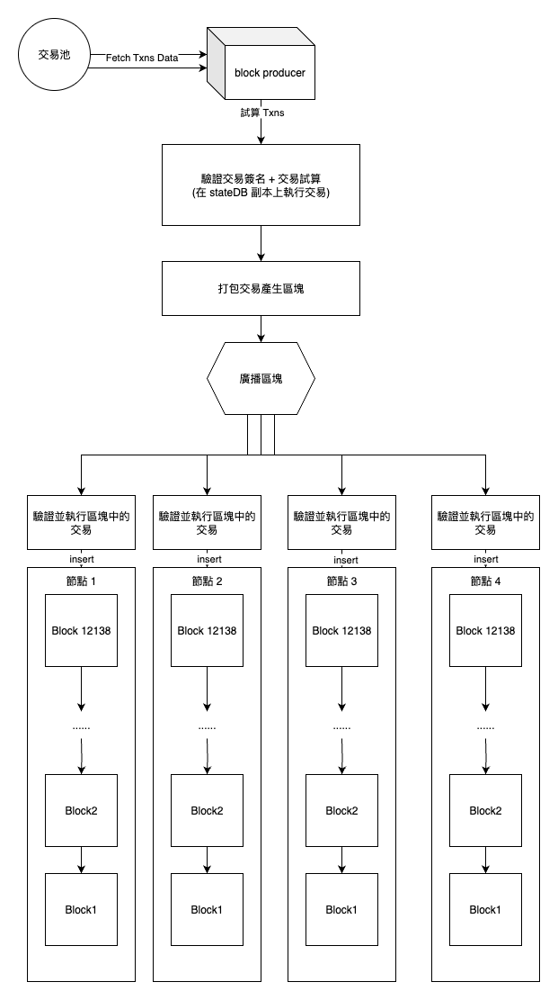

# 關於以太坊驗證交易資料

<br>

---

<br>

## 前提

我在實現一個目標為還原以太坊技術細節的 blockchain 個人小專案．

在之前的一篇文章中我有提到 [以太坊錢包地址產生規則 + 交易簽署與驗證原理 (Golang 實作)](https://ithelp.ithome.com.tw/articles/10369659)．

其中有解釋到私鑰簽署交易，與使用 `Ecrecover(RSV, 交易訊息)` 還原公鑰．

在我後續實作 __打包交易產塊__ 時，我想測試一下如果我偽造交易驗證．是否在驗證交易簽名階段就可以抓出來偽造行為．但是結果卻跟我想的不一樣．

<br>
<br>
<br>
<br>

## 產塊 Main Flow

<br>

節點在產生區塊時的幾個重要 main flow:

1. 在交易池中蒐集 PENDING 狀態的交易
2. 執行被選取的交易 (使用當前節點上的 stateDB 做交易試算，並不是真的動到實際帳戶)
3. 計算交易後的 state tree root
4. 產生 recipient (交易收據)
5. 產生 block header (連結上一個區塊，存入 state tree root...)
6. 產生 block -> `types.NewBlock(header, includedTxs, receipts)`

<br>

當某一個節點產生新區塊之後，接下來就會把這個新的區塊廣播給其他節點，在這一步驟中每一個節點收到區塊資料後都會重複一個一個的驗證並執行交易，最終同步到自己節點的 blockchain 中．

如下圖：



<br>

假如產塊的節點偽造了交易細節，比如把某一筆交易的 transfer amount 從 10000 調整成 10．其他收到廣播的節點是不是應該要能識別出來交易被偽造呢？

<br>

總的來說，透過以太坊的交易驗證設計，最終是可以驗證得到交易被竄改的事實，但是過程並不單純只是靠驗證交易簽名與交易資訊．

<br>
<br>

## 關於 Ecrecover

<br>

首先要看一下一筆轉帳交易是如何被簽名的：

```go
// SignTx use private to sign txn
// 1. calculate tx_hash
// 2. sign with private key
// 3. store V, R, S
func (tx *Transaction) SignTx(privateKey *ecdsa.PrivateKey) error {
	// 1. calculate tx_hash
	h := tx.signingHash()

	// 2. sign with private key
	sig, err := crypto.SignMessage(privateKey, h[:])
	if err != nil {
		return err
	}

	if !sig.Validate() {
		return common.ErrInvalidSignature
	}
	// 3 store V, R, S
	tx.data.signature = sig

	return nil
}

// signingHash return tx_hash (AccountNonce + Recipient + Amount + GasLimit + Payload)
func (tx *Transaction) signingHash() common.Hash {
	rawData := []interface{}{
		tx.data.AccountNonce,
		tx.data.Recipient, // ETH receiver address
		tx.data.Amount,
		tx.data.GasLimit,
		tx.data.GasPrice,
		tx.data.Payload,
	}
	bytes, err := common.RlpEncodeToBytes(rawData)
	if err != nil {
		log.Error("failed to rlp encode transaction", "err", err)
		return common.Hash{}
	}
	return crypto.Keccak256Hash(bytes)
}
```

<br>

簽署的資料 source 是交易的 account nonce, recipient(address), amount, gas limit ...

用直覺思考的話，如果在簽名完成後，我去偷偷修改 tx.data.Amount 的值，會導致驗證階段產出的 hash data 發生變化．進而產生簽名驗證失敗的結果．

<br>

__實際測試驗證簽名時，卻不完全是這樣__．在我偽造 amount 進行簽名驗證時，`func Ecrecover(RSV, txHashData) (publicKey, error)` 並沒有回傳錯誤，__而是回給我一個
全新的 publicKey。其對應的地址也是完全沒見過的新地址__，這完全出乎我的意料．

這樣一來雖然無法還原出正確地址進行轉帳操作，但是如果還原出的這個新地址是其他人的帳戶怎麼辦？難到可以亂造假帳使鏈上帳戶資金被亂動嗎？

<br>

帶著這個疑惑，我又回去查閱了以太坊的帳戶設計文獻，發現 `Ecrecover()` 確實會有這樣的問題產生，但是相應的有 account nonce 這個欄位可以解決這一問題．

account nonce 可以理解為隨著 account __每一次帳戶異動都會自動 + 1 的遞增 id__．當 account 擁有者簽署一筆交易時，必須在交易中輸入當前 account 的 nonce 是多少．

比如小王有一個以太坊 account，當前 nonce 是 20．小王簽署了一個轉帳交易內容：

```go
{
    tx.data.AccountNonce = 20,
    tx.data.Recipient = "0x521147b68d948f24A341E5C0Da50Fa5AA39A06D7", // 轉帳目的帳戶
    tx.data.Amount = 1000000,
    tx.data.GasLimit = 10000,
    tx.data.GasPrice = 1000,
    tx.data.Payload = [],
}
```

檢查 nonce 的機制可以確保防止交易重送，同一筆交易不會被執行兩次(nonce 必須等於當前 account nonce)．同時也被用於保護帳戶防止被偽造交易影響．

<br>

假如有人想要偽造小王的這筆交易金額，修改成 `amount = 10`。這樣節點在進行 `Ecrecover` 時會還原出一個完全不相干的帳戶，這邊舉例為還原出小紅的帳戶．
如果此時不檢查小紅的 account nonce 直接執行轉帳交易，會使小紅莫名其妙被轉走 10 wei 的餘額．如果此時多檢查一次 account state 中小紅帳戶的 account nonce 則可以保護小紅的帳號免於被盜用(除非偽造交易的人可以完完全全算得剛好，這個機率低到可以忽略不計)．

<br>
<br>

## 總結


以太坊在驗證區塊中的交易時並執行時，會走以下流程：

1. 先會驗證區塊的所有交易資料產生的 txn merkle root(本文未提到)．

2. 使用 `func Ecrecover(RSV, txHashData) (publicKey, error)` 還原出每一筆交易簽署的公鑰以及地址 (如果資料被偽造，則地址會是另一個毫不相干的地址)．

3. 驗證簽署地址的 nonce 是否等於交易資料中的 nonce．

4. 檢查帳戶餘額

5. 執行 `transfer()` 轉帳

6. 更新 blockchain

<br>

`Ecrecover()` 並不能直接保證交易的合法性，必須同時用 account nonce 加上 account balance 檢查，才能完全實現安全的交易驗證功能．


